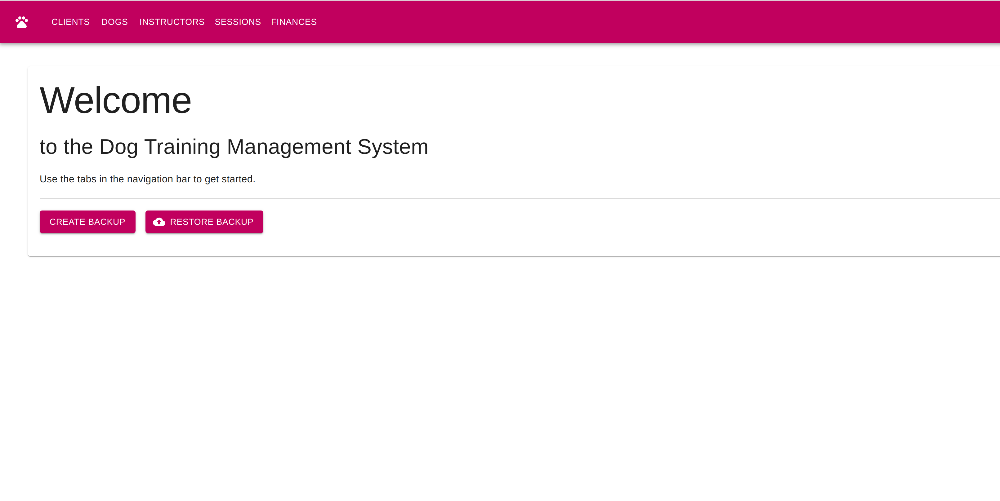
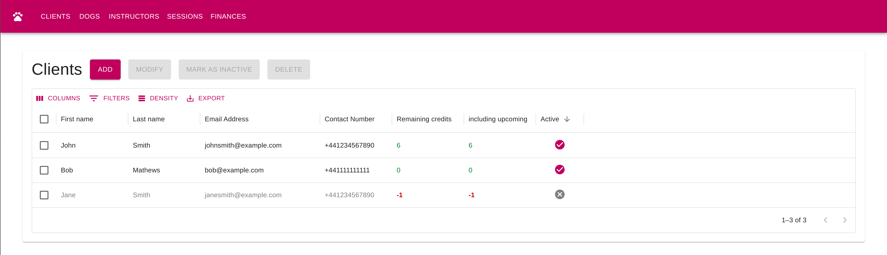
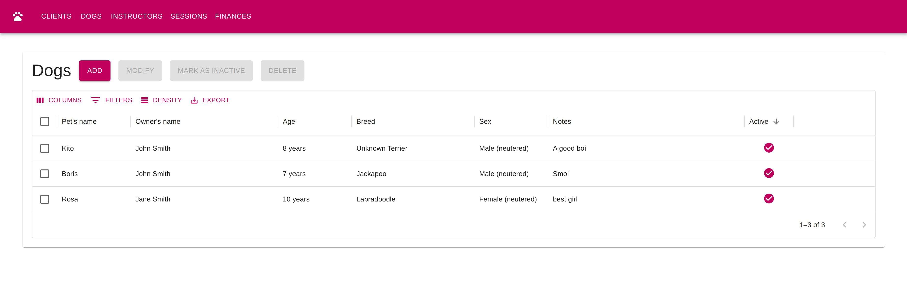
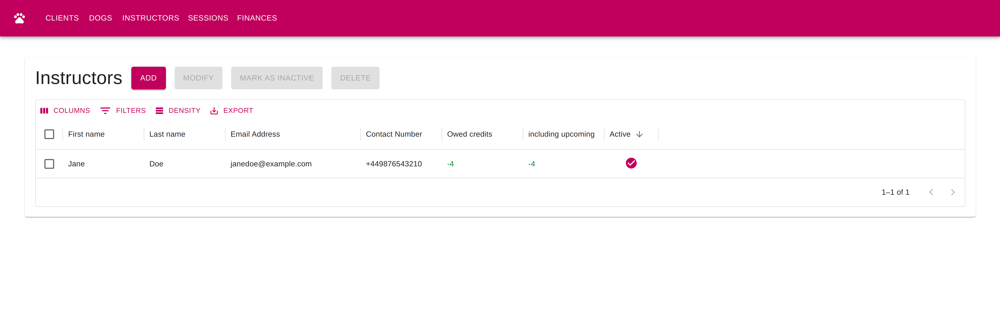
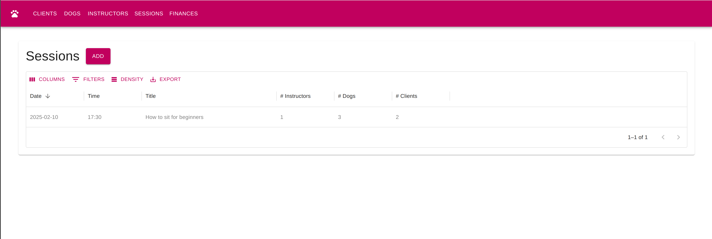
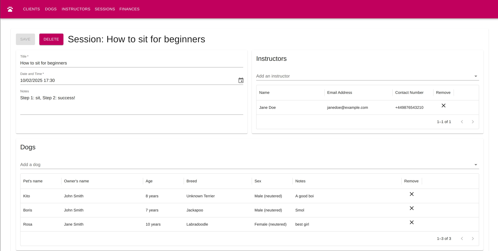
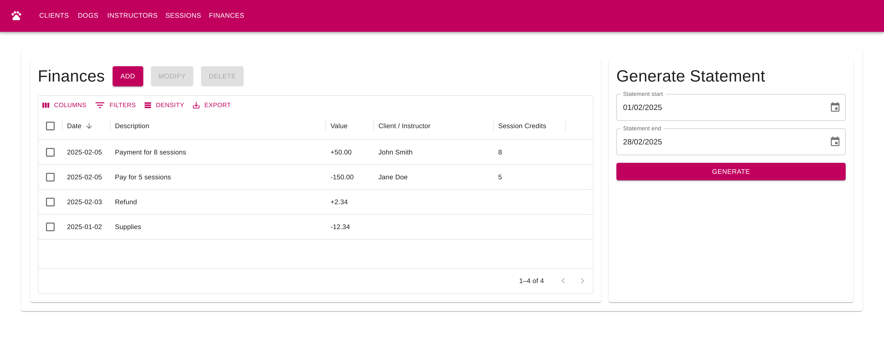

# Dog Training Management

A management system for an admin of a dog training club.

## Features

* Client management
    * Keep track of active clients
* Dog management
    * Keep track of active dogs
* Instructor management
    * Keep track of active instructors
* Session planning
    * Assign clients + dogs as well as instructors
* Finance tracking
    * Client-based income (credits for sessions)
    * Instructor-based expenses (wages for sessions)
    * Miscellaneous
    * Finacial statement report generation
* Back up and restore

## Screenshots

